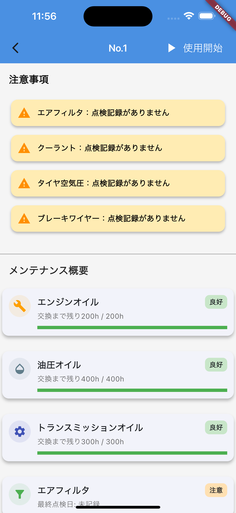
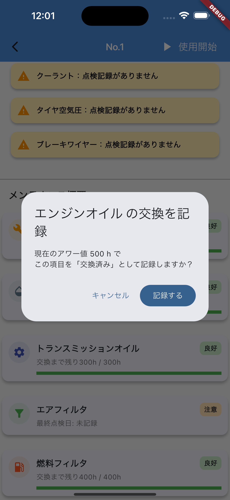
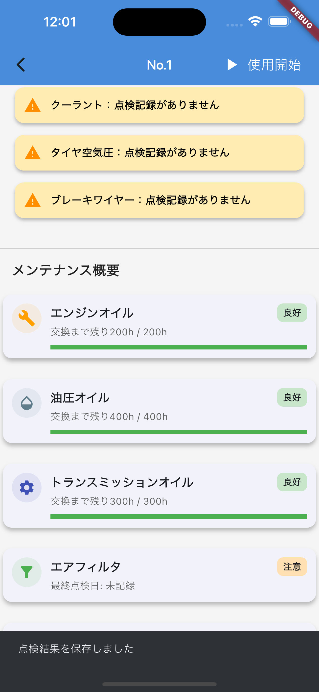
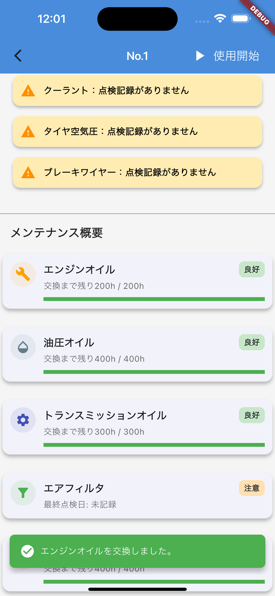
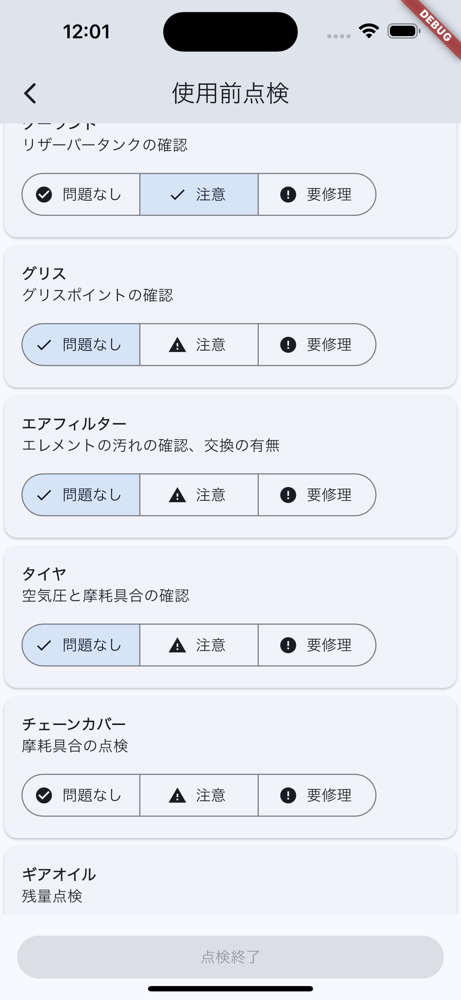

# FarmFlow
農業現場の「紙の始業点検」をスマホで置き換える、トラクター点検・メンテナンス管理アプリです。


## 📕Overview
FarmFlow は、作業者が**トラクターを使い始めるタイミング**にチェックリスト点検を行い、状態と履歴を残して、**故障の見落とし・情報共有もれ**を減らすことを目指すモバイルアプリです。
- 想定ユーザー：作業者
- 利用シーン：トラクターを使い始めのタイミング（始業前）

## Background（なぜ作ったか）
トラクターの故障が多く、始業前点検を行う運用になりましたが、紙のチェックリストでは以下の問題がありました。

- 1年分の点検用紙が大量に溜まり、保管場所に困る
- 異常は記録しているが、総務などが体系的に確認していない
- 記録が現場で共有されず、次の作業者が故障に気づかず使用してしまうことがあった

これらの課題から、スマートフォンで始業前点検を記録・共有できる仕組みが必要だと考え、本アプリを作成しました。

## Features（できること）
- 機械一覧の表示
- 機械詳細（ステータス）の表示
  - メンテ項目を `⚪︎ / 200h` のようなゲージで可視化
- 始業前点検（チェックリスト）の記録
- 交換・貼り直しの記録
  - 交換頻度が高い項目は **長押し** で交換記録できるようにして操作を簡略化

### ステータス対象項目（例）
- エンジンオイル / クーラント / グリス / エアフィルター / タイヤ
- ロータリーチェーンカバー摩耗 / ギヤオイル / 耕運爪
※インターバル時間は Kubota の始業前点検・説明書の推奨値を参照して設定

## なぜこの技術スタックか（技術選定理由）

FarmFlow は「始業前点検」を現場で確実に回すことが目的のため、
**MVPとして素早く検証できること**と、
**現場で使いやすいUIを作り込みやすいこと**
を重視して技術選定しました。

### Flutter / Dart（フロントエンド）
- **現場向けUIの実装と改善が速い**  
  Widgetベースの宣言的UIにより、点検項目カード・ステータス表示・長押し操作などを部品化しやすく、画面改修に追従しやすいと判断しました。
- **iOS / Android を単一コードベースで対応**  
  現場配布や検証コストを抑えながら、MVP開発を進められる点を評価しました。
- **状態管理（Riverpod）と合わせて保守性を意識した構成にできる**  
  UIとアプリケーションロジックを分離しやすく、将来的な拡張（画面追加・同期処理・エラー表示の強化）にも対応しやすい構成を学べると考えました。

> ※将来的にネイティブ実装（Swift/Kotlin）が必要になる可能性も理解した上で、初期段階では「検証速度」と「UI変更耐性」を優先しています。

### Python / FastAPI（バックエンド）
- **小規模MVPとして実装サイクルを高速化できる**  
  現場要件の試行錯誤を前提に、シンプルにAPIを立ち上げて検証できる点を重視しました。
- **型ヒント + Pydantic による入力/出力の明確化**  
  API仕様をコードで表現しやすく、データ構造の変更にも追従しやすいと判断しました。
- **将来的な拡張を見据えたWeb API構成**  
  モバイルからAPIを呼ぶ構成にしておくことで、Web版や管理画面、他システム連携にも発展させやすい設計にしています。

### SQLite（DB）
- **開発・検証が軽量**  
  MVP段階では環境構築コストを抑え、まず「動くもの」を優先するためSQLiteを採用しました。
- **将来的な移行が容易**  
  データ量や運用規模が増えた段階で、PostgreSQL等への移行を想定しています。

## Tech Stack
- Frontend: Dart / Flutter / Riverpod
- Backend: Python / FastAPI
- DB: SQLite

## 🚀 セットアップ手順

### 前提条件
- Flutter 3.x
- Python 3.10+
- Git

### フロントエンド (Flutter)
```bash
# リポジトリをクローン
git clone https://github.com/atekasu/Farmflow.git
cd Farmflow

# 依存パッケージをインストール
flutter pub get
```

**実行方法（いずれか）：**
- VSCode: エミュレータを起動 → F5 でデバッグ実行
- ターミナル: `flutter run`

### バックエンド (FastAPI)
```bash
cd backend

# 仮想環境を作成・有効化
python -m venv venv
source venv/bin/activate  # Windowsの場合: venv\Scripts\activate

# 依存パッケージをインストール
pip install -r requirements.txt

# 初期データを投入
python seed.py

# サーバーを起動
uvicorn main:app --reload

# 動作確認
curl -s http://127.0.0.1:8000/machines
```

## Demo / Usage（デモ手順）
1. 機械一覧を開く
2. 点検したい機械を選択する
3. 機械ステータス（例：`⚪︎ / 200h`）で各項目の状態を確認する
4. 始業前点検を開く
5. チェックリストに沿って記録する（必要なら長押しで交換記録）

## 📱 スクリーンショット

### 機械一覧


### 機械詳細（ステータス / 注意事項 / ゲージ）


### 交換記録



### 使用前点検（チェックリスト）



## Offline-first（現場要件）
山間部の圃場など通信が使えない環境があるため、  
基本はサーバー中心で運用しつつ、通信不可のときはローカルに保存し、後で同期できる方針で設計しています。

## Architecture / Design
- ドメイン（トラクター等）のモデル設計は **継承より合成（has-a）** を重視
- フロントは MVVM を意識し、フォルダを `screen / widget / data` に分割


### Frontend (Flutter) - `lib/`
- `api/` … APIクライアント（例: `machine_api.dart`）
- `application/` … 状態管理・アプリケーション層（Provider/Notifier）
- `data/` … Repository / 固定データ / ダミー
- `domain/` … 生成ロジック等（例: `machine_factory.dart`）
- `model/` … ドメインモデル（machine, maintenance, precheck）
- `providers/` … DI / Repository切り替え（例: `repository_provider.dart`）
- `screen/` … 画面（Home / Detail / PreCheck）
- `widget/` … UI部品（カード・リストなど）

### Backend (FastAPI) - `backend/`
- `main.py` … エントリポイント
- `models.py` / `schemas.py` … DBモデル / APIスキーマ
- `database.py` … DB接続
- `seed.py` … 初期データ投入
- `farmflow.db` … SQLite DB（開発用）
